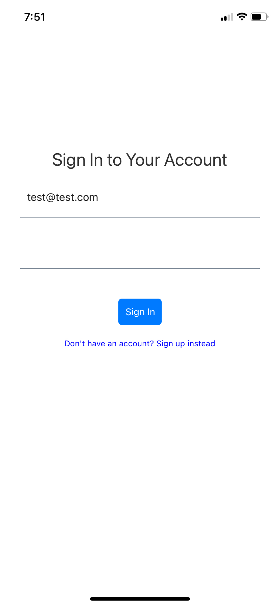
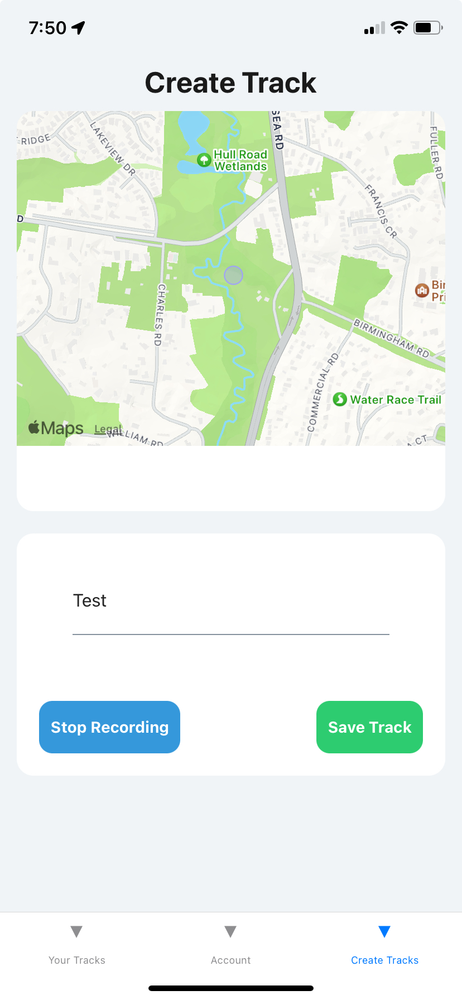
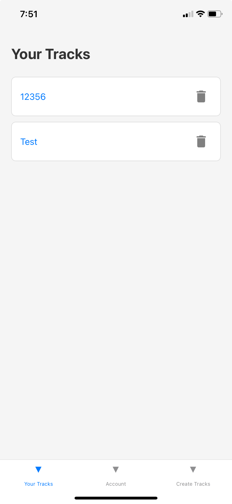
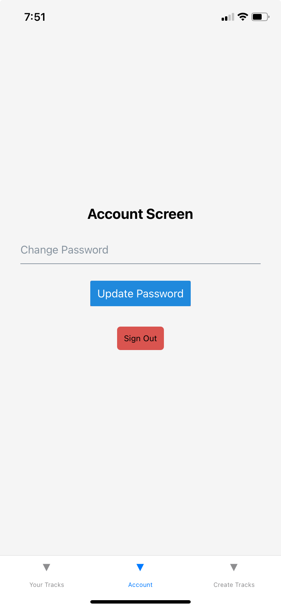

This project is a React Native application designed for tracking and saving user paths using GPS data. It integrates with an Express.js server and MongoDB backend to save and manage track records.

## Features

- **User Authentication:** Sign up and sign in using JWT-based authentication.
- **Track Recording:** Record GPS locations in real-time using mock location data for testing.
- **Track Management:** Save, view, and delete recorded tracks.
- **Map Visualization:** Display recorded paths on an interactive map using `react-native-maps`.

## Technologies Used

- **Frontend:** React Native, Expo, React Navigation, React Native Maps.
- **Backend:** Node.js, Express.js, MongoDB, Mongoose.
- **State Management:** Context API with custom hooks.
- **Styling:** React Native Elements for UI components.

## Usage

- **Sign Up/In:** Create an account or log in with existing credentials.
- **Start Recording:** Enter a track name and start recording your path.
- **Stop and Save Track:** Stop recording and save your track with location data.
- **View Tracks:** Navigate to the track list to view saved tracks and see detailed paths on the map.
- **Delete Tracks:** Delete saved tracks as needed.

## File Structure

- **Backend (`track-server`):**

  - **`models/`**: Mongoose models for User and Track.
  - **`routes/`**: Express routes for authentication and track management.
  - **`middlewares/`**: JWT-based authentication middleware.

- **Frontend (`src`):**
  - **`screens/`**: All React Native screens, including Login, TrackCreate, TrackList, and TrackDetail.
  - **`context/`**: Context providers for authentication, location tracking, and track management.
  - **`components/`**: Reusable components like forms and maps.

## Key Code Highlights

- **Mock Location Data:** Uses `expo-location` to simulate location data during development.
- **Track Management:** Saves user tracks with GPS coordinates to MongoDB.
- **Error Handling:** Handles errors with appropriate messages and validations to enhance user experience.

